# AES with Cipher Block Chaining Message Authentication Code (AES-CBC-HMAC)
One of the limitation of [AES-CBC](#TODO) is that it does not provide any integrity/authenticity check.  
To prevent tampering of the ciphertext, we can use a [HMAC](../mac/hmac.md) to verify the integrity of the ciphertext.

This type of construction is also called _encrypt-then-MAC_

```mermaid
graph LR
    PT([Plaintext]) --> CBC[Cipher Block Chaining]
    IV([Initialization Vector]) --> CBC
    CBC --> C([Ciphertext<br><em>public</em>])
    C --> concat["➕ Concatenate"]
    IV --> concat
    concat --> HMAC[HMAC]
    SK([Symmetric Key<br><em>secret</em>]) --> HMAC
    HMAC --> AT([Authenticated Ciphertext])
    
    style SK fill:#f9f,stroke:#333,stroke-width:4px
```

## Example
TODO

## Security
TODO

## Limitations/Caveats
TODO
