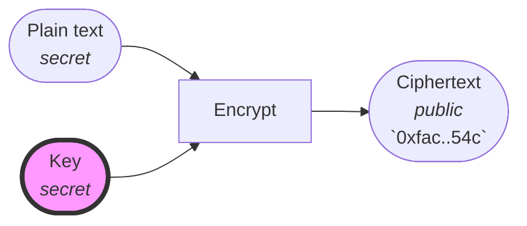
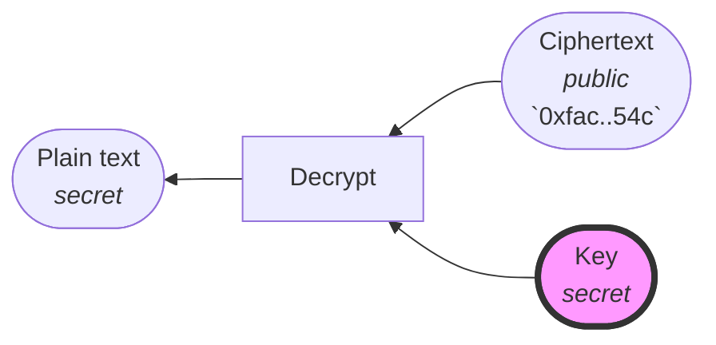

# Authenticated Encryption
A MAC that can be reversed.

```mermaid
flowchart LR
    A([Plain text<br><em>secret</em>]) --> B[Encrypt]
    B --> C([Ciphertext<br><em>public</em><br>`0xfac..54c`])
    D([Key<br><em>secret</em>]) --> B

style D fill:#f9f,stroke:#333,stroke-width:4px
```

```mermaid
graph RL
    A([Ciphertext<br><em>public</em><br>`0xfac..54c`]) --> B[Decrypt]
    B --> C([Plain text<br><em>secret</em>])
    D([Key<br><em>secret</em>]) --> B
    
style D fill:#f9f,stroke:#333,stroke-width:4px
```

