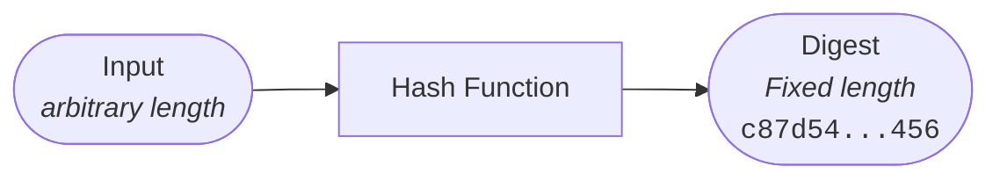

A hash function is any function that can be used to map data of arbitrary size to fixed-size values, though there are some hash functions that support variable length output[^1].

[^1]: https://en.wikipedia.org/wiki/Hash_function



## Example

```bash
openssl dgst -sha256 -binary -out digest.bin file.txt
```

## Application(s)

Hash functions can be used data for integrity and authenticity checks ([checksums](../../definitions)).

## Security

- pre-image resistance/one-way: given a digest, it is infeasible to find a message that hashes to the digest.
  ```mermaid
  graph LR

  A([Digest]) -->B[Hash Function]
  B --> C([Input])
  B -.-> A
  C -.-> B
  linkStyle 2 stroke:red, stroke-dasharray: 5;
  linkStyle 3 stroke:red, stroke-dasharray: 5;
  ```
- second pre-image resistance: given an input and the corresponding digest, it is infeasible to find a different input that hashes to the same digest.
  ```mermaid
   graph LR

   A([Input]) -->B[Hash Function]
   B --> C([Digest])
   D([?]) -.-> B -.-> C([Digest])

   style D stroke: red;
   linkStyle 2 stroke:red, stroke-dasharray: 5;
   linkStyle 3 stroke:red, stroke-dasharray: 5;
  ```
- collision resistance: given a digest, it is infeasible to find two different messages that hash to it.
  ```mermaid
   graph LR

   A([?]) -->B[Hash Function]
   B --> C([Digest])
   D([?]) -.-> B -.-> C([Digest])

   style A stroke: red;
   style D stroke: red;
   linkStyle 0 stroke:red, stroke-dasharray: 5;
   linkStyle 1 stroke:red, stroke-dasharray: 5;
   linkStyle 2 stroke:red, stroke-dasharray: 5;
   linkStyle 3 stroke:red, stroke-dasharray: 5;
  ```

## Limitations / Caveats

!> **Length of input matters to avoid being able to find a second pre-image.**  
If the input space is small, it becomes easy to iterate over it to find a pre-image for the digest.

!> **Length of digest matters to avoid collisions.**  
This is why it is recommended to use a hash function with a digest length of at least 256 bits in practice (to have security of $128 = \frac{256}{2}$ bits).

!> When using a pre-computed hash function as a data integrity, one needs to trust its origin: it assumes a trusted channel has been created.
