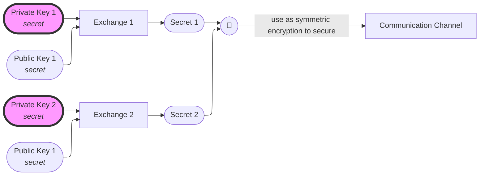

# Key Exchange

A restriction of symmetric cryptography is that it requires a trusted communication channel to exchange the secret that will be used to encrypt the messages between 2 parties.  
Key Exchanges that rely on _asymmetric cryptography_ __partially__ solve this problem by allowing 2 parties to establish such a channel.  

By combining **your own private key** with **somebody else's public key**, you can produce a secret, which will match the secret that the other party will get by combining **their private key** with **your public** key.  
That secret can then be used as a symmetric encryption key.  

!> **Unauthenticated** key exchanges are only secure to **passive** Man In The Middle attacks.  
Only **authenticated** key exchanges are secure to **active** Man In The Middle attacks.  
(Protocols like [TLS](/protocols/tls) or [PKI](/protocols/pki) rely on certificates and [digital signatures](/primitives/signature) for the authentication part of their key exchanges.)
