# Key Exchange

A restriction of symmetric cryptography is that it requires a trusted communication channel to exchange the secret that will be used to encrypt the messages between 2 parties.\
Key Exchanges that rely on _asymmetric cryptography_ **partially** solve this problem by allowing 2 parties to establish such a channel.

By combining **your own private key** with **somebody else's public key**, you can produce a secret, which will match the secret that the other party will get by combining **their private key** with **your public** key.\
That secret can then be used as a symmetric encryption key.

```mermaid
---
config:
   layout: elk
---

graph LR
    PRIVK1([Private Key 1<br><em>secret</em>]) --> E1["Exchange 1"] --> S1(["Secret 1"])
    PUBK2([Public Key 1<br><em>secret</em>]) --> E1
    PRIVK2([Private Key 2<br><em>secret</em>]) --> E2["Exchange 2"] --> S2(["Secret 2"])
    PUBK1([Public Key 1<br><em>secret</em>]) --> E2

    S1 --> eq(["🟰"])
    S2 --> eq --"use as symmetric encryption to secure" --> C["Communication Channel"]
    
    style PRIVK1 fill:#f9f,stroke:#333,stroke-width:4px
    style PRIVK2 fill:#f9f,stroke:#333,stroke-width:4px
```

## Generalized Framework

To construct a key exchange protocol, we generally need

### 1. A one way function

$f: G \rightarrow H$ is easy to compute but hard to invert.

?> **One way**\
This kind of functions are found in the [NP-hard](https://en.wikipedia.org/wiki/P_versus_NP_problem) set of problems.

### 2. Commutativity

So that $ f(xy) = f(yx)$\
We need commutativity so that the secret is the same for both parties.\
We can have commutativity either if:

1. $G$ is an [abelian group](https://en.wikipedia.org/wiki/Abelian_group) (G is itself commutative)
   $$x.y = y.x \quad \forall x,y \in G \implies f(x.y) = f(y.x)$$
2. $f$ is an [homomorphism](https://en.wikipedia.org/wiki/homomorphism) (1) and $S$ is abelian (2).
   $$f(xy) = f(x).f(y) \quad \forall x,y \in G\tag{1}$$
   $$f(x).f(y) = f(y).f(x) \quad \forall x,y \in G \tag{2}$$
   $$\text{1 and 2} \implies f(xy) = f(yx).f(y) = f(y).f(x) = f(yx)$$
