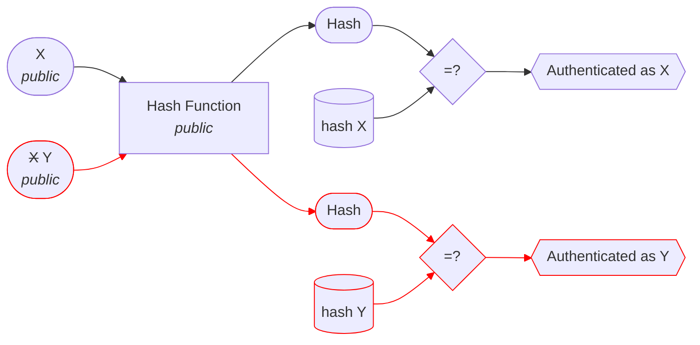

# MAC
In cryptography, a message authentication code (MAC), sometimes known as an authentication tag, is a short piece of information used for authenticating a message.
In other words, to confirm that the message came from the stated sender (its authenticity) and has not been changed.
The MAC value protects a message's data integrity, as well as its authenticity, by allowing verifiers (who also possess the secret key) to detect any changes to the message content.

The point of the secret key is to avoid tampering with the tag. Indeed, using a pre-computed (received) hash an authentication proof is  not secure, as the hash function is not a secret:


## Example
```bash
printf "%s" "value" | openssl sha256 -hmac "key"
```

## Application(s)
MAC can be used to provide a **trusted channel**.

## Security

## Limitations / Caveats

