A MAC is a keyed [checksum](../../definitions) of a message that is sent along with the message.
It takes in a fixed-length secret key and an arbitrary-length message, and outputs a fixed-length checksum.[^1]
Any change to the message will render the checksum invalid, allowing verifiers (who need to also possess the secret key) to detect any changes to the message content.

```mermaid
graph LR

A([Secret Key <br><em>fixed length</em>]) -->C[MAC]
B([Message <br><em>arbitrary length</em>]) -->C[MAC]
C --> F([Authentication Tag<br><em>Fixed length</em><br> <code>d56d54...123</code>])
B --> concat["➕ Concatenate"]
F --> concat
concat --> |send|message(["<code>message|MAC</code>"])

style A fill:#f9f,stroke:#333,stroke-width:4px
```



The point of the secret key is to avoid tampering with the tag. Indeed, using only a pre-computed (received) hash an authentication proof is not secure, as the hash function is not a secret:


By requiring an additional secret key to compute the authentication tag, we can prevent impersonating another user.


## Example

```bash
printf "%s" "value" | openssl sha256 -hmac "key"
```

## Application(s)

MAC can be used to provide a **trusted channel**.\
Especially **cookies** rely on MACs to provide a (one-way) trusted communication channel from a client towards a server.
With cookies, a server can securely authenticate clients and trust the information originating from them as being "authentic".
:::note
Cookies as an authentication mechanism doesn't scale well because the server needs to provide a cookie for each client, and store their reference values in a database to perform the authentication later.
:::

## Security

- resistance against forgery: a valid authentication tag can only be generated by the owner of the secret key.

## Limitations / Caveats

!> **MACs don't provide confidentiality**.  
The message sent is not encrypted and can be read by observers.

!> **MAC verification time should be constant.**  
Otherwise, MACs become subject to timing attacks.[^2]

!> **For the resistance against forgery to hold, the secret key must be long enough.**  
At least 16 bytes (128 bits).

!> **MACs can't be reused**.  
They don't prevent replays (especially that's why cookies have an expiration date).
One way to prevent replays is to use a counter or a nonce (a random number that is never reused).

[^1]: https://textbook.cs161.org/crypto/macs.html#82-mac-definition
[^2]: https://en.wikipedia.org/wiki/Timing_attack
