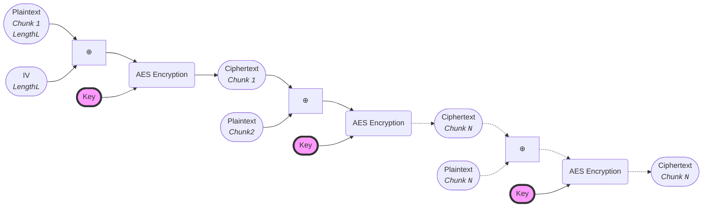

# Advanced Encryption Standard (AES) in Cipher Block Chaining (CBC) mode

AES-CBC is the combination of the [AES](aes) block cipher and the [CBC](cbc) mode of operation.

```mermaid
graph LR

pt([Plaintext<br><em>Chunk <code>1</code><br>Length<code>L</code></em>]) --> XOR["⊕"]
iv([IV<br><em>Length<code>L</code>]) --> XOR
XOR --> BCE(AES Encryption)
SK([Key]) --> BCE
BCE --> c([Ciphertext <br><em>Chunk <code>1</code></em>])
c --> XOR2["⊕"]
pt2([Plaintext<br><em>Chunk<code>2</code></em>]) --> XOR2
XOR2 --> BCE2(AES Encryption)
SK2([Key]) --> BCE2
BCE2 -.-> c2([Ciphertext <br><em>Chunk <code>N</code></em>])
c2 -.-> XOR3["⊕"]
pt3([Plaintext<br><em>Chunk <code>N</code></em>]) -.-> XOR3
XOR3 -.-> BCE3(AES Encryption)
SK3([Key]) --> BCE3
BCE3 -.-> c3([Ciphertext <br><em>Chunk <code>N</code></em>])

style SK fill:#f9f,stroke:#333,stroke-width:4px
style SK2 fill:#f9f,stroke:#333,stroke-width:4px
style SK3 fill:#f9f,stroke:#333,stroke-width:4px
```
