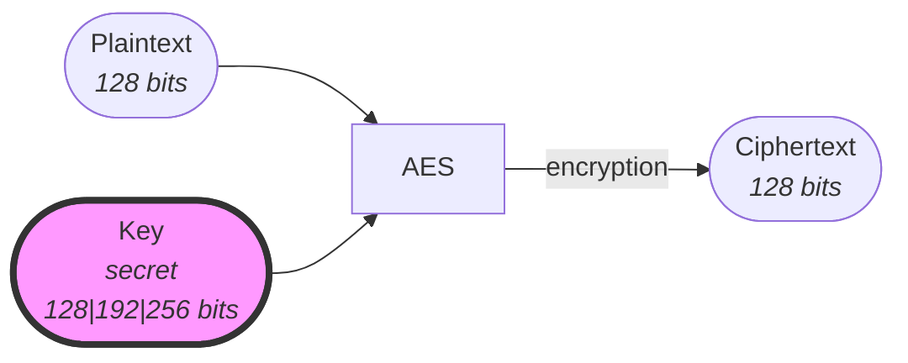
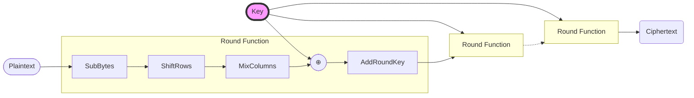

# Advanced Encryption Standard (AES)

The Advanced Encryption Standard (original name Rijndael) is Block Cipher implementation specified by the U.S. National Institute of Standards and Technology (NIST) in 2001[^1].

Under the hood, AES uses a round function composed of 4 steps to encrypt a block of data. The round function is applied 10, 12 or 14 times depending on the key size.

## Limitations/Caveats

:::caution
**Is a block cipher**.\
As-is it can only encrypt/decrypt fixed-length blocks of data. So a block cipher mode of operation must be applied for it to become an encryption/decryption algorithm applicable to messages of arbitrary length.
:::

[^1]: https://nvlpubs.nist.gov/nistpubs/FIPS/NIST.FIPS.197.pdf
