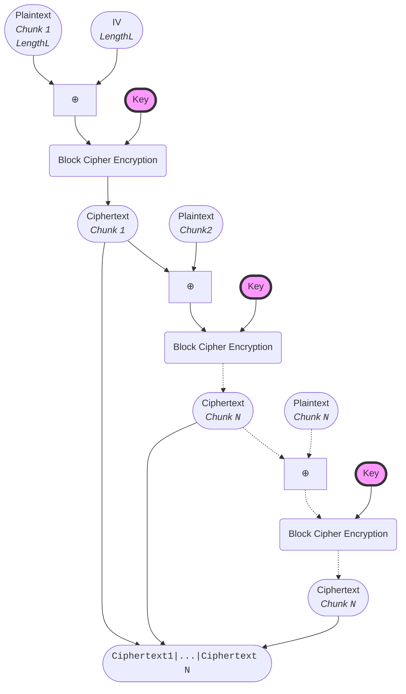
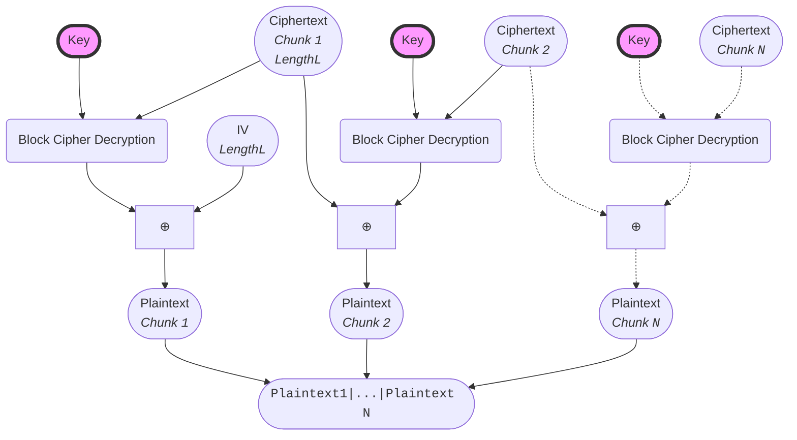

# Cipher Block Chaining (CBC)
CBC recursively encrypts a plaintext by XORing it with the previous ciphertext block to randomize the encryption (and avoid the pitfall of e.g. the Electronic Codebook mode, see [ECB Penguin](https://words.filippo.io/the-ecb-penguin/)).  
This is done by first encrypting the IV with the key and then XORing the result with the first plaintext block.  
The result is then encrypted with the key and XORed with the second plaintext block.  
This process is repeated until the last plaintext block is reached.  
The last ciphertext block is then the ciphertext.

---
