# Symmetric Encryption (SE)
Symmetric-key encryption is a family of encryption algorithms that use the **same** cryptographic key(s) for both the encryption of plaintext and the decryption of ciphertext.[^1]

```mermaid
flowchart LR
    A(["📄"]) --> B[Encrypt]
    B --> C([Ciphertext<br><em>public</em><br>`0xfac..54c`])
    D(["🔑<br><em>secret</em>"]) --> B

style D fill:#f9f,stroke:#333,stroke-width:4px
```

```mermaid
graph RL
    A([Ciphertext<br><em>public</em><br>`0xfac..54c`]) --> B[Decrypt]
    B --> C(["📄"])
    D(["🔑<br><em>secret</em>"]) --> B
    
style D fill:#f9f,stroke:#333,stroke-width:4px
```

[^1]: https://en.wikipedia.org/wiki/Symmetric-key_algorithm

## Application(s)
- Confidentiality: encrypting data so that only parties knowing the secret key can read it.

## Limitations / Caveats
:::caution
A trusted communication channel is required to securely perform the key exchange.
:::
:::caution
It doesn't scale well as performing a private and secure key-exchange between each pair of communicating parties is impractical.  
E.g on the web, a situation where scaling matters, [asymmetric encryption](../asymmetric-encryption/intro) is rather used, together with [PKI](#TODO) to securely exchange keys.
:::
