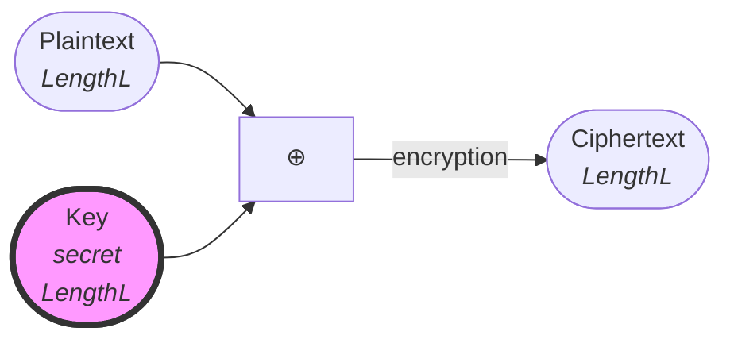
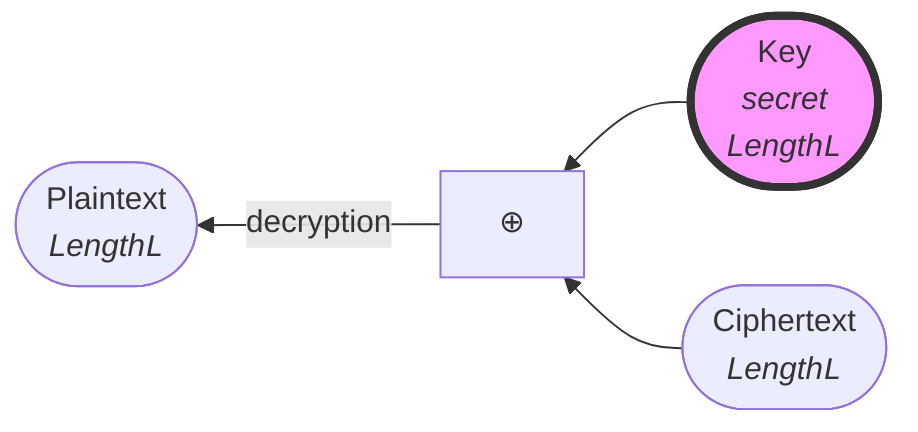

# One Time Pad (OTP)

The one-time pad (OTP) is a symmetric-key encryption algorithm that relies on the bitwise XOR (exclusive-or) operation (written as ⊕) to "scramble" a message into a ciphertext.

## Limitations/Caveats
:::caution
**The key must be random.** (uniform distribution)
:::

:::caution
**The key and plaintext must have the same length.**
:::

:::caution
**The secret key must not be reused.** ("one-time")
- Because anyone who knows a plaintext and its ciphertext can reconstruct the key.
- Because anyone who knows 2 ciphertexts $C$ and $C'$ can deduce $C \oplus C' = M \oplus M'$, which leaks information about $M$ and $M'$ and can be enough to deduce $M$ or $M'$[^1]. 
:::

[^1]: https://crypto.stackexchange.com/a/108

